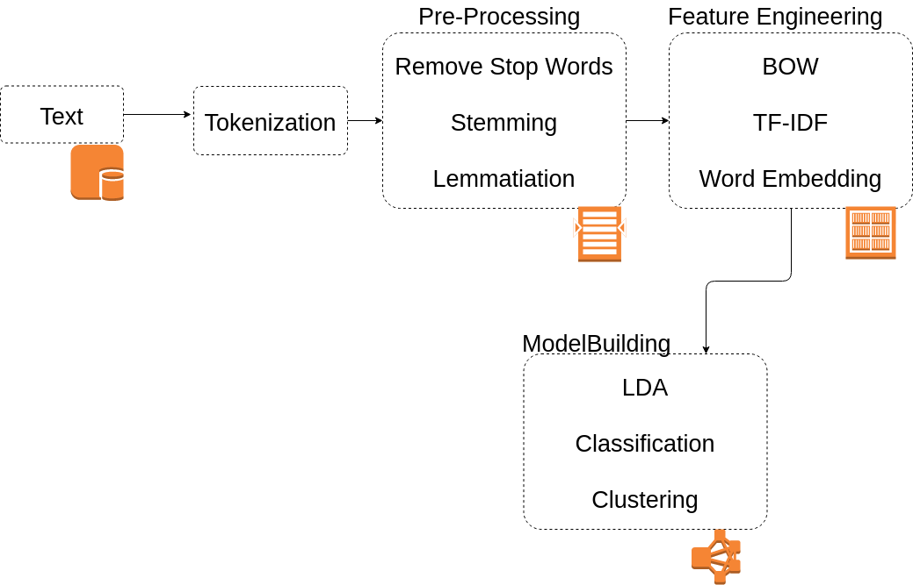

.. pytma documentation master file, created by sphinx-quickstart on Tue Apr 14 10:29:06 2019. You can adapt this file completely to your liking, but it should at least contain the root `toctree` directive.

Welcome to pytma's documentation!
====================================

`pytma` is a library for NLP modelling in Python.

We rely on excellent Python libraries nltk, spacy, and gensim for pre-processing and model fitting.

To see how to use it, please refer to the `README file
<https://github.com/brucebcampbell/nlp-modelling/blob/master/README.md>`_ in the Github repository.

This is the general workflow for using the library. 

Contents:

.. toctree::
   :maxdepth: 2

   theory
   auto_examples/index
   api
